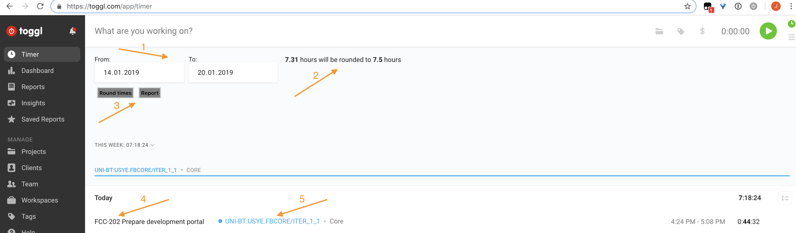

# Integration from Toggl to Plus4U and Jira

# Install as a User Script - Tampermonkey
1. Add https://tampermonkey.net/ into your browser
1. Install User script from this URL: [toggl2plus4u.user.js](https://raw.githubusercontent.com/jiri-neuman/toggl2plus4u/master/toggl2plus4u.user.js)

# Description

1. Selection of interval to work with - by default set to current week.
1. Summary of the work for selected interval and next to it sum of the work after rounding is applied (to review how the rounding changes the sum of your work)
1. Action buttons to round the times (updates time reports in Toggl) and send time sheet reports to Plus4U and Jira.
1. Description of the work log with JIRA task reference
1. Work log project 

## Rounding
Before reporting, the times should be rounded to whole 15 minutes. 
In the toolbar, you can see the sum of the work for your selected interval and next to it, sum of work after rounding for review.
 
## Reporting to Plus4U 
1. Open the [https://toggl.com/app/timer](Timer) page in Toggl.
1. Adjust the date interval for which you want to report your work. 
1. Round the times and send work log by using buttons in the toolbar.   

Mapping between Toggl fields and Plus4U:

 | Toggl        | Plus4U |
 | --- | --- | 
 | description      | description| 
 | project      | subject      | 
 | tag (only first) | category |
 | start | time from |
 | stop | time to |  

## Reporting to Jira
1. Work will be also reported to JIRA if the description of the work log contains JIRA ticket in the beginning. 
The ticket must be separated by space from the following description (e.g. FCC-200 Workspace setup).
1. Report will be sent to Jira only if it is successfully reported to Plus4U.
    * The script relies on Plus4U behavior, which returns error for overlapping work logs. This way, it is ensured that no work is logged more than once.    

Mapping between Toggl fields and Plus4U:

 | Toggl        | Jira |
 | --- | --- | 
 | description (without jira ticket id)     | description | 
 | start | log time |
 | duration | duration |

# Errors, messages
Currently there is no gui feedback - all messages and errors are logged only to the javascript console.  

